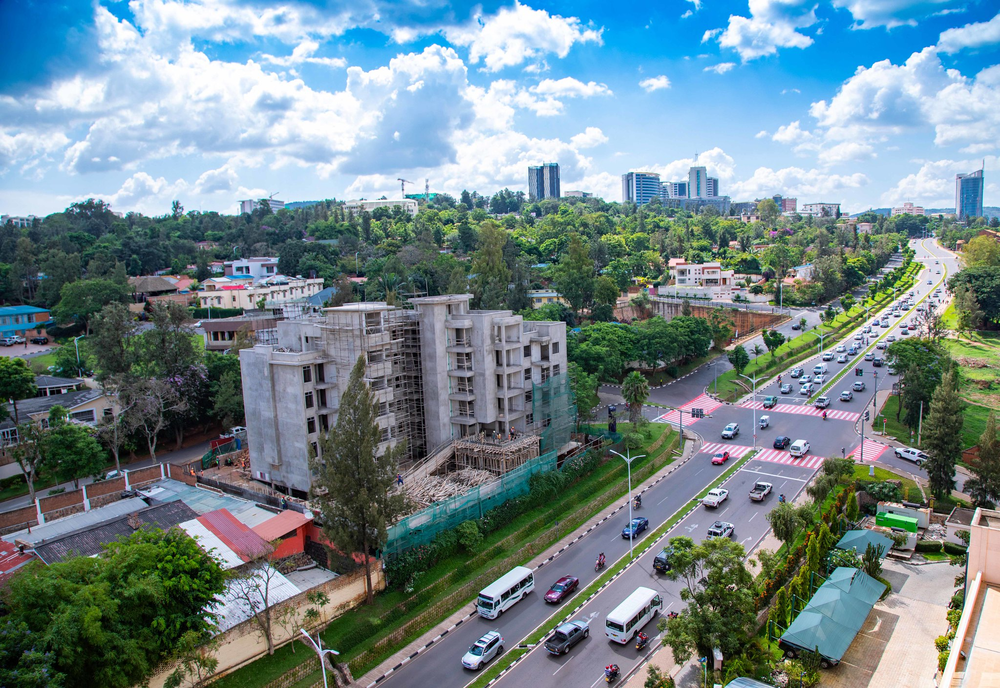
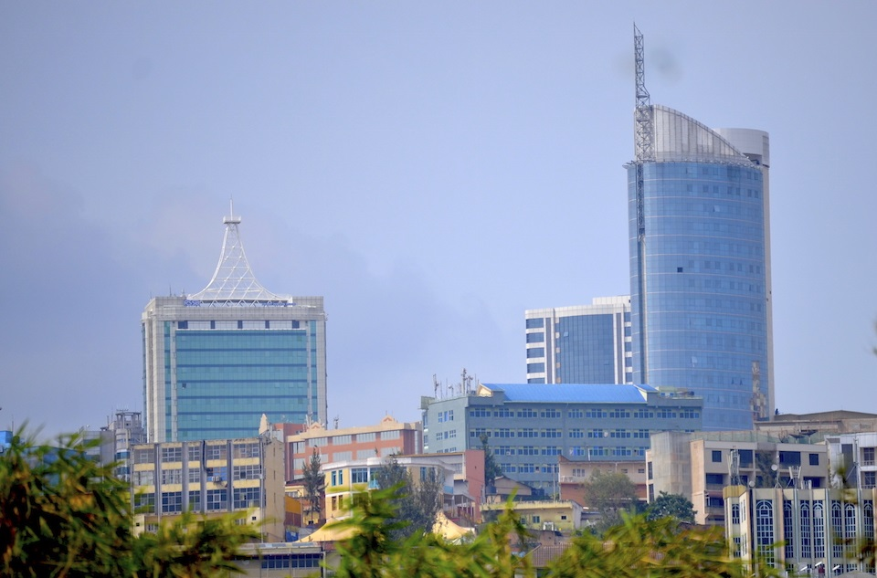

---
hide:
  - navigation
---

Author: Terrance Schotsman
Thumbnail by David Shankbone
# Paul Kagame's Rwanda
***

 

# Introduction
Rwanda, a landlocked East African country infamous for its ethnic genocide in 1994. This article will focus on its improvement since then. It is difficult to rival a genocide in terms of human rights violations, so where is it now? Has Paul Kagame's possibly totalitarian regime done any better?

# The Election
Kagame was a military leader during the mass murder of the Tutsi ethnic minority; like most of the military and government at the time, he was of the Hutu majority, but unlike them, he played an integral role in ending the genocide that led to him becoming the de facto president. Eventually, when enough stability returned for elections, he invoked the memory of violent murder, rape, and widespread economic collapse that was still fresh in the minds of voters.

# Wealth Inequality
In present day, however, young voters did not experience the tragedy, and so their image of their president is one of political abductions, frequent embezzlement, and rigged voting he has used to keep his power. Despite this, dissent is voiced only in private settings as Internet access is rare outside the capital, Kigali. There now exists a large-scale divide in Rwanda: the majority of lower-class citizens who work in farming on a subsistence level (producing only as much as they need to survive) that is more conducive to other sub-Saharan African nations. Meanwhile, the higher-class citizens live in American-style housing, have relatively stable Internet access, and earn almost European paychecks. Most of the people in the latter group have ties either to the ruling party or Kagame himself, which is corroborated by stories told by escapees of aging public infrastructure and wealth inequality.

# Differentiation
So far, Rwanda sounds like the average African dictatorship, even comparable to North Korea in some ways. Where it differentiates itself, however, is in crime rates. Similar cases such as Equatorial Guinea, the DR Congo, Eswatini, and Lesotho all rank in the bottom 50% of the world according to Numbeo.com's statistics. Paul Kagame's regime ranks among the world's top 15 safest countries along the Netherlands, Denmark, and Canada. So, how accurate is this ranking?

# The Reasons
Numbeo is a privately owned Serbian company, so putting lobbying aside, Rwanda does appear to highly prioritize safety, with the government and police holding frequent meetings to discuss crime. Despite reported crime figures increasing in the past few years, this alone as a source of data may be skewed by a few factors:
Improved reporting methods causing a perceived spike that is actually not new
Growing population causing the pure number of committed offenses to go up
Or, this could be a legitimate sign of resistance. Time will tell. For the former, however, other data released by the government shows immigrants from neighbouring countries helping to grow the population, but also being largely responsible for crime, being arrested more often on average than native Rwandans. Maybe someday the country will adopt Western immigration ideas into its laws.

# Conclusion
Overall, Rwanda is undoubtedly a dictatorship, but it falls just short of the requirements to be a totalitarian state. Its relative safety makes it an outlier in the African region, but its corruption and rigged elections bring it back to the continent it is located in.

## Works Cited
???- note "View Works Cited"

    “Africa: Crime Index by Country 2025 Mid-Year.” Numbeo.com, www.numbeo.com/crime/rankings_by_country.jsp?title=2025-mid&region=002. Accessed 11 Dec. 2025. 

    Biden, Sam. “Silenced Critics – the Repression of Journalism in Rwanda.” Human Security Centre, 8 July 2024, www.hscentre.org/africa/silenced-critics-repression-journalism-rwanda/. 

    “Euro Zone.” Countryeconomy.com, countryeconomy.com/countries/euro-zone. Accessed 11 Dec. 2025. 

    Hassan, Tirana. “Rwanda.” Human Rights Watch, 15 Dec. 2023, www.hrw.org/world-report/2024/country-chapters/rwanda. 

    Kanamugire, Johnson. “Making Sense of the Personality Cult Taking Root in Rwanda.” NewsPaper Africa, 21 Mar. 2025, newspaper.africa/2025/03/21/making-sense-of-the-personality-cult-taking-root-in-rwanda/. 

    Muhire, Philos. “Theft remains the most prevalent crime in Rwanda.” ICK News, 5 Jan. 2025, ickjournalism.com/theft-remains-the-most-prevalent-crime-in-rwanda/. 

    “Rwanda: Crime Prevention a Development Imperative, Says Justice Minister.” Allafrica.com, 23 Oct. 2025, allafrica.com/stories/202510230031.html. 

    “Rwanda Tops List of Africa’s Safest Nations.” Africa Briefing - News. Analysis. Comment, 2 July 2025, africabriefing.com/rwanda-tops-africa-safety-index-2025/. 

    Weerdesteijn, M. “The Rationality and Reign of Paul Kagame.” Perpetrators of International Crimes, edited by Maartje Weerdesteijn, Oxford U PressOxford, 2019, pp. 224–238. 