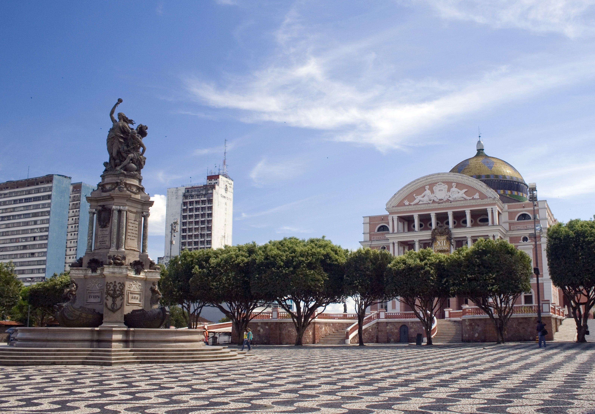

Author: Terrance Schotsman
Thumbnail image by Portal da Copa/ME
***

 

## The Problem
The city council of Manaus, Brazil has much on its plate. The city it presides over is located within the Brazilian state of Amazonas, and therefore within the Amazon rainforest. Being one of, if not the most biodiverse regions on Earth means it is highly vulnerable to environmental changes in the area. We at Tiaki News understand that the city is large and it is preventatively difficult to avoid causing damage to the Amazon ecosystems, but the current effects of life in the area are difficult to overlook. The problem does not lie with the registered formal buildings in and around the centre of Manaus, but rather with the informal settlements expanding on the edges of the city. The lack of regulation of this expansion is the majority of the problem, and this is a symptom of overpopulation. Then there is the alienation and displacement of indigenous people-groups. Monte Horebe was originally an indigenous settlement that was destroyed in 2015 and is now an unregistered residential neighbourhood.

## Solutions
The solutions we see include zoning reforms that protect the Amazon rainforest from excessive damage, and increased spending on enforcing these reforms along with possible legal motions to increase the severity of punitive measures. However, enacting just these suggestions would create a new problem: slums would become even more densely populated as further expansion into the rainforest would become impossible. The foreseen outcome would be a Kowloon Walled City of sorts, and the solution for this new problem would be to invest into infrastructure, building new organized and registered neighbourhoods to lower the housing costs that drove inhabitants into these slums in the first place.
More standard advice for cities harming nearby ecosystems is similar to what is tailored to your specific case; tighten regulations on the protection of the environment, penalize further expansion in unvetted directions, and most importantly, investing in infrastructure to lower the housing costs. If possible, ensure that some natural aspects remain in the area that is being urbanized such as dense pockets of vegetation. These help with mental health, the city's attractiveness to expats, and (ever so slightly) with air quality.

## Works Cited
???- note "View Works Cited"
    “Biodiversity and the Amazon Rainforest.” Greenpeace, Greenpeace USA, 22 May 2020, www.greenpeace.org/usa/biodiversity-and-the-amazon-rainforest/.
    Coogan, Sylvia. “The Expanding City of Manaus.” Esri, 7 Apr. 2023, storymaps.arcgis.com/stories/d627062a2b434ba3a8ec6416ae7a7db6.
    Laurance, William F., and Jayden Engert. “Sprawling Cities Are Rapidly Encroaching on Earth’s Biodiversity.” Proceedings of the National Academy of Sciences of the United States of America, vol. 119, no. 16, 2022, p. e2202244119, https://doi.org/10.1073/pnas.2202244119.
    Ren, Qiang, et al. “Impacts of Urban Expansion on Natural Habitats in Global Drylands.” Nature Sustainability, vol. 5, no. 10, 2022, pp. 869–878, https://doi.org/10.1038/s41893-022-00930-8.
    Simkin, Rohan D., et al. “Biodiversity Impacts and Conservation Implications of Urban Land Expansion Projected to 2050.” Proceedings of the National Academy of Sciences of the United States of America, vol. 119, no. 12, 2022, p. e2117297119, https://doi.org/10.1073/pnas.2117297119.
    “Solutions.” The Overpopulation Project, 7 Mar. 2019, overpopulation-project.com/solutions/.
    Zipperer, Wayne C., et al. “Urban Development and Environmental Degradation.” Oxford Research Encyclopedia of Environmental Science, vol. 2020, Oxford University Press, 27 Aug. 2020.
